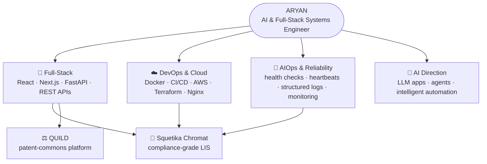

<h1 align="center">Aryan</h1>
<h3 align="center">AI & Full-Stack Systems Engineer</h3>

Full-Stack · DevOps · AIOps · Cloud · AI Engineering

I build complete systems — frontend experiences, backend APIs, automated infrastructure, observable operations, and intelligent workflows.

---

## 🧭 System Map

---

## ⚡ What I Build

| Domain | Focus |
|---|---|
| 🧩 **Full-Stack Engineering** | Production web apps, API design, backend systems, system architecture |
| ☁️ **DevOps & Cloud** | Containers, CI/CD pipelines, cloud infra, deployment automation |
| 🤖 **AIOps & Reliability** | Health monitoring, heartbeat telemetry, structured logging, operational automation |
| 🧠 **AI Engineering** | Currently building toward LLM apps, agents & intelligent workflows |
| 🔐 **Secure Engineering** | Auth systems, data integrity, RBAC, auditability |

---

## 🧬 Engineering by the Numbers

*Scope descriptors — what the systems contain, not vanity metrics.*

| System | What's inside |
|---|---|
| 🧪 **Squetika Chromat** | 11-page React SPA · 9 API route groups · 4 auth layers · dual SHA-256 hash chain · .NET 8 Windows Service · multi-tenant Terraform design |
| ⚖️ **QUILD** | 9 App-Router modules · Next.js 16 + React 19 · scoring + governance + royalties engines |
| 🔐 **Security posture** | JWT + API-key + RBAC (4 roles) + row-level isolation · WORM immutability · lockout + password history |
| 📦 **Delivery** | Docker Compose stacks · GitHub Actions CI/CD · IaC for 10 isolated tenants |

---

## 🛠️ Stack

### Languages

### Full-Stack

### Cloud · DevOps · Data

### Security & Integrity

---

## 🚀 Featured Engineering

### 🧪 [Squetika Chromat](https://github.com/Aryan0047-ak/squetika-chromat-v2) — flagship

Compliance-grade digital HPLC Laboratory Information System. The flagship proof that I design systems where **data integrity is architectural, not an afterthought**.

- ⛓️ Dual SHA-256 hash-chain architecture (edge + server) with a verification endpoint
- 🔑 4-layer auth: JWT + machine API keys + role checks + lab-level isolation
- ✍️ Electronic-signature workflows with password re-entry and audit linkage
- 🖥️ .NET 8 Windows Service connector with offline journal + auto catch-up
- 📊 11-page operations dashboard: instruments, sequences, OOS, audit, e-signatures
- 🏗️ Multi-tenant AWS design (Terraform) + Docker Compose production stack

`Python` `FastAPI` `React` `TypeScript` `.NET 8` `PostgreSQL` `Docker` `Terraform` `CI/CD`

### ⚖️ [QUILD](https://github.com/Aryan0047-ak/QUILD) — modern frontend systems

Open-source patent-commons platform: portfolio analytics, validation workflows, micro-ownership scoring, governance and royalties — 9 modules on the Next.js App Router.

- 📊 Analytics-first dashboards with live KPIs, trends and ownership views
- 🧠 Rule-based scoring engine across 16 contribution dimensions
- 🗳️ Governance + royalties workflow modeling (proposals, vesting, payouts)
- ✨ Motion-rich UI with Tailwind v4 + Framer Motion + Recharts

`Next.js 16` `React 19` `TypeScript` `Tailwind v4` `Recharts`

---

## 🧭 Current Direction

Deepening across:

- **AI engineering** — LLM applications, agents, intelligent automation
- **Systems architecture** — distributed, observable, production-oriented design
- **AIOps** — from heartbeat telemetry toward anomaly detection + auto-remediation
- **Cloud-native delivery** — hardened pipelines, IaC, zero-downtime deploys

---

## 🏗️ Philosophy

> Scalable · Observable · Automated · Secure · Maintainable
>
> Software → Infrastructure → Operations → Intelligence.
> I work across the whole chain.

---

## 🤝 Connect

Systems over features. Integrity over shortcuts.

